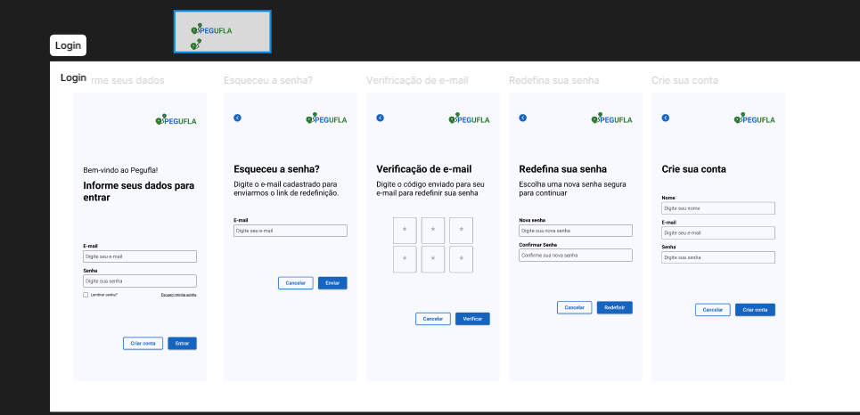

# Sprint 2

## Tela inicial, login e mais

Aqui está o protótipo:

As interfaces desenvolvidas foram:

### Tela de Login
A tela de login permite que o usuário acesse sua conta utilizando e-mail e senha. Também possui opções de “lembrar senha”, recuperação de acesso e criação de conta.

### Tela “Esqueceu a senha?”
Essa interface foi criada para permitir que o usuário solicite a recuperação da senha através do e-mail cadastrado no sistema.

### Tela de Verificação de E-mail
Após solicitar a recuperação, o usuário deve inserir o código de verificação enviado para o e-mail informado anteriormente.

### Tela de Redefinição de Senha
A tela permite que o usuário defina uma nova senha para sua conta após a validação do código de verificação.

### Tela de Criação de Conta
Essa interface possibilita o cadastro de novos usuários na plataforma, solicitando informações básicas como nome, e-mail e senha.

Todas as telas seguem uma mesma identidade visual, mantendo padronização de cores, botões, estrutura dos formulários e posicionamento dos elementos, garantindo maior consistência visual e melhor experiência para o usuário.
