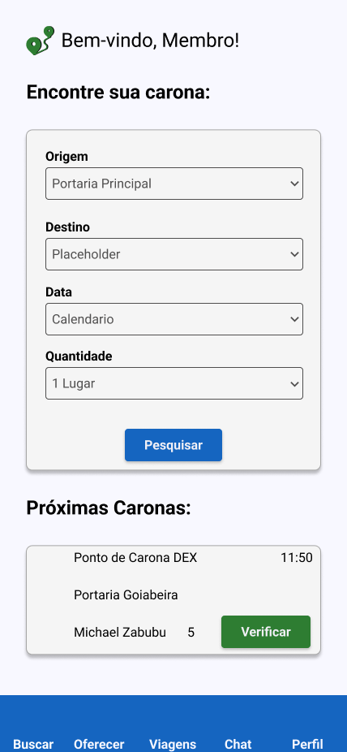
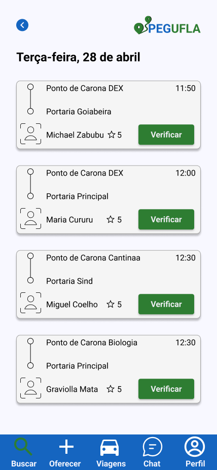
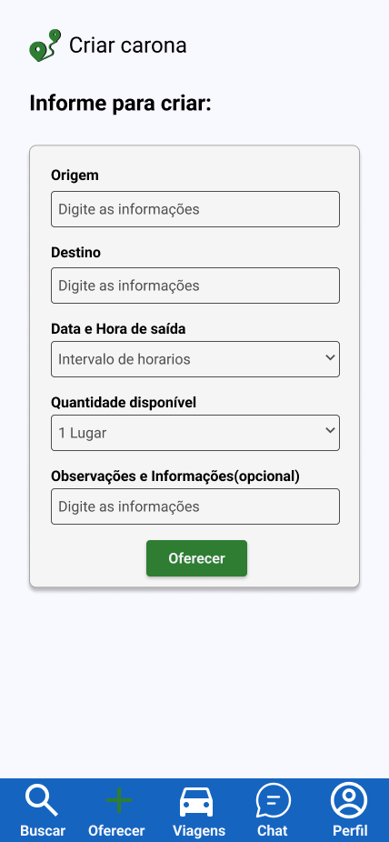
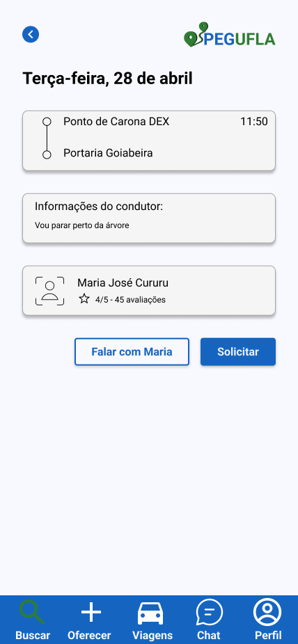
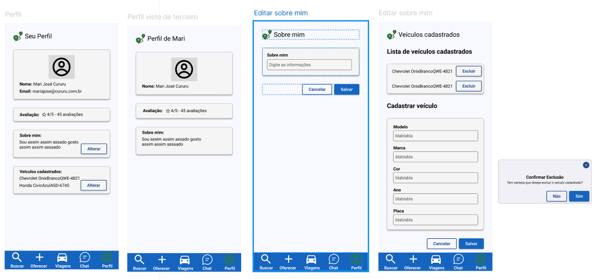

#### Sprint 3
### Tela de Dashboard

A tela de Dashboard marca o início da navegação principal do usuário após o login. Ela apresenta uma saudação inicial ao membro e permite que ele encontre caronas disponíveis de forma rápida e objetiva.

Nesta tela, o usuário pode filtrar a busca por:
- origem;
- destino;
- data;
- quantidade de lugares.

Abaixo do formulário de busca, há a seção “Próximas Caronas”, que exibe uma prévia das caronas disponíveis, apresentando informações como ponto de saída, destino, horário, motorista, quantidade de vagas e botão para verificar mais detalhes.

A tela também possui uma barra de navegação inferior, permitindo acesso rápido às principais áreas do sistema: buscar carona, oferecer carona, viagens, chat e perfil.

### Tela de Listagem de Caronas

A tela de listagem é exibida após o usuário realizar uma pesquisa por caronas na Dashboard. Seu objetivo é apresentar, de forma organizada, todas as viagens disponíveis de acordo com os filtros selecionados anteriormente.

Cada card de carona apresenta informações importantes para o usuário, como:
- ponto de saída;
- destino;
- horário da viagem;
- nome do motorista;
- avaliação do motorista;
- botão para visualizar os detalhes da carona.

A interface foi projetada para facilitar a visualização rápida das opções disponíveis, utilizando uma estrutura simples e intuitiva. Além disso, os cards seguem um padrão visual consistente com as demais telas do sistema.

A tela também mantém a barra de navegação inferior, permitindo acesso rápido às principais funcionalidades da plataforma.

### Tela de Criar Carona

A tela de criação de carona permite que o usuário cadastre uma nova viagem na plataforma, disponibilizando vagas para outros estudantes.

Nessa interface, o usuário deve informar:
- origem da carona;
- destino;
- data e horário de saída;
- quantidade de vagas disponíveis;
- observações ou informações adicionais opcionais.

Após o preenchimento das informações, o usuário pode concluir o cadastro da viagem através do botão “Oferecer”.

A tela foi desenvolvida com foco em simplicidade e praticidade, utilizando campos organizados e uma estrutura intuitiva para facilitar o processo de criação da carona.

Além disso, a interface mantém a identidade visual das demais telas do sistema, garantindo padronização e melhor experiência de navegação.

### Tela de Detalhe da Carona

A tela de detalhes da carona apresenta informações completas sobre uma viagem selecionada pelo usuário na listagem de caronas.

Nessa interface, são exibidos:
- ponto de saída;
- destino;
- horário da viagem;
- informações adicionais fornecidas pelo motorista;
- perfil do condutor;
- avaliação do motorista e quantidade de avaliações recebidas.

Além das informações da viagem, a tela oferece duas ações principais:
- botão para entrar em contato com o motorista;
- botão para solicitar participação na carona.

A interface foi projetada para transmitir as informações de forma clara e objetiva, permitindo que o usuário tome decisões com mais segurança antes de solicitar a vaga.

A tela também mantém a identidade visual e a barra de navegação inferior utilizadas em todo o sistema.

### Tela de Viagens

A tela de viagens foi desenvolvida para permitir que o usuário acompanhe suas caronas ativas, gerencie solicitações recebidas e visualize o histórico de viagens concluídas.

Na seção “Viagem ativa e pedidos”, são exibidas as informações da viagem atualmente cadastrada pelo usuário, incluindo origem, destino, data e horário.

Além disso, a tela apresenta os usuários que solicitaram participação na carona, mostrando:
- nome do passageiro;
- avaliação do usuário;
- quantidade de avaliações recebidas.

Para cada solicitação, o motorista pode:
- aprovar o pedido de participação;
- recusar a solicitação.

A interface também possui a seção “Histórico de viagens concluídas”, responsável por exibir viagens já finalizadas anteriormente pelo usuário.

Toda a estrutura foi desenvolvida visando facilitar o gerenciamento das caronas de maneira prática, organizada e intuitiva.

### Telas de Perfil

As telas de perfil foram desenvolvidas para permitir que os usuários visualizem e gerenciem suas informações pessoais dentro da plataforma.

As interfaces criadas incluem funcionalidades relacionadas à visualização do perfil próprio, visualização de perfil de terceiros, edição de informações pessoais e gerenciamento de veículos cadastrados.

#### Perfil do Usuário
A tela principal de perfil apresenta:
- foto do usuário;
- nome;
- e-mail;
- avaliação recebida na plataforma;
- descrição “sobre mim”;
- veículos cadastrados.

Além disso, o usuário pode acessar opções para alterar suas informações pessoais e editar os veículos vinculados à conta.

#### Perfil visto por terceiros
Também foi desenvolvido um modelo de perfil público, exibido para outros usuários da plataforma. Nessa visualização, são mostradas apenas informações relevantes para interação entre passageiros e motoristas, como:
- nome;
- avaliação;
- descrição pessoal.

#### Editar Sobre Mim
A interface de edição permite que o usuário personalize sua descrição pessoal dentro da plataforma, possibilitando adicionar informações relevantes sobre preferências, comportamento ou detalhes importantes para as caronas.

#### Gerenciamento de Veículos
A tela de gerenciamento de veículos permite:
- visualizar veículos cadastrados;
- excluir veículos;
- cadastrar novos automóveis.

Os campos disponíveis incluem:
- modelo;
- marca;
- cor;
- ano;
- placa.

Também foi criada uma interface de confirmação de exclusão, garantindo maior segurança durante a remoção de veículos cadastrados.

Todas as telas seguem a mesma identidade visual do sistema, mantendo padronização entre componentes, formulários e navegação.

