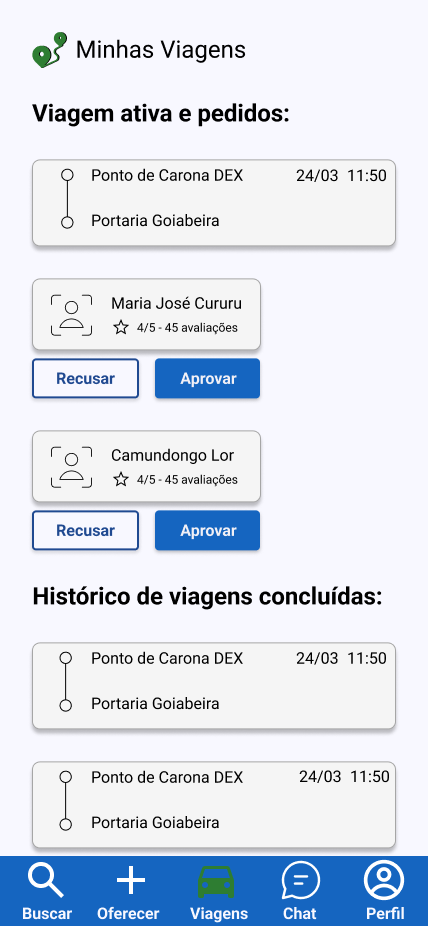

## Sprint 5

### Tela de Viagens

A tela de viagens foi desenvolvida para permitir que o usuário acompanhe suas caronas ativas, gerencie solicitações recebidas e visualize o histórico de viagens concluídas.

Na seção “Viagem ativa e pedidos”, são exibidas as informações da viagem atualmente cadastrada pelo usuário, incluindo origem, destino, data e horário.

Além disso, a tela apresenta os usuários que solicitaram participação na carona, mostrando:
- nome do passageiro;
- avaliação do usuário;
- quantidade de avaliações recebidas.

Para cada solicitação, o motorista pode:
- aprovar o pedido de participação;
- recusar a solicitação.

A interface também possui a seção “Histórico de viagens concluídas”, responsável por exibir viagens já finalizadas anteriormente pelo usuário.

Toda a estrutura foi desenvolvida visando facilitar o gerenciamento das caronas de maneira prática, organizada e intuitiva.

### Telas de Perfil

As telas de perfil foram desenvolvidas para permitir que os usuários visualizem e gerenciem suas informações pessoais dentro da plataforma.

As interfaces criadas incluem funcionalidades relacionadas à visualização do perfil próprio, visualização de perfil de terceiros, edição de informações pessoais e gerenciamento de veículos cadastrados.

#### Perfil do Usuário
A tela principal de perfil apresenta:
- foto do usuário;
- nome;
- e-mail;
- avaliação recebida na plataforma;
- descrição “sobre mim”;
- veículos cadastrados.

Além disso, o usuário pode acessar opções para alterar suas informações pessoais e editar os veículos vinculados à conta.

#### Perfil visto por terceiros
Também foi desenvolvido um modelo de perfil público, exibido para outros usuários da plataforma. Nessa visualização, são mostradas apenas informações relevantes para interação entre passageiros e motoristas, como:
- nome;
- avaliação;
- descrição pessoal.

#### Editar Sobre Mim
A interface de edição permite que o usuário personalize sua descrição pessoal dentro da plataforma, possibilitando adicionar informações relevantes sobre preferências, comportamento ou detalhes importantes para as caronas.

#### Gerenciamento de Veículos
A tela de gerenciamento de veículos permite:
- visualizar veículos cadastrados;
- excluir veículos;
- cadastrar novos automóveis.

Os campos disponíveis incluem:
- modelo;
- marca;
- cor;
- ano;
- placa.

Também foi criada uma interface de confirmação de exclusão, garantindo maior segurança durante a remoção de veículos cadastrados.

Todas as telas seguem a mesma identidade visual do sistema, mantendo padronização entre componentes, formulários e navegação.

