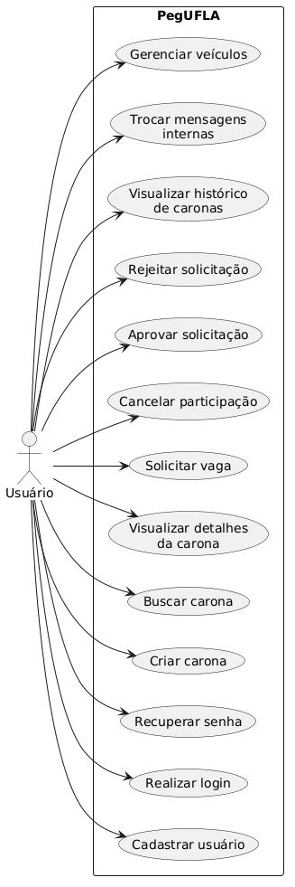

# Modelagem do Sistema PegUFLA

## 1. Diagrama de Casos de Uso

O diagrama de casos de uso representa as principais funcionalidades do sistema e a interação do usuário com essas funcionalidades.

O ator principal do sistema é o usuário, que pode realizar ações como cadastro, login, criação e busca de caronas, além de interagir com outros usuários por meio da plataforma.

