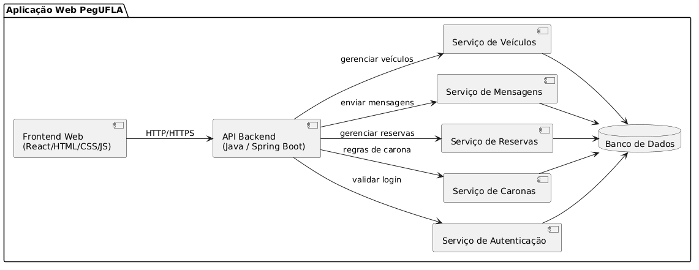
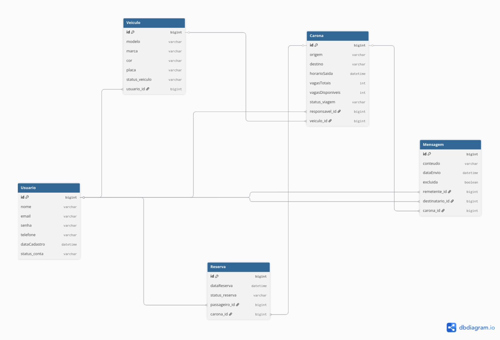
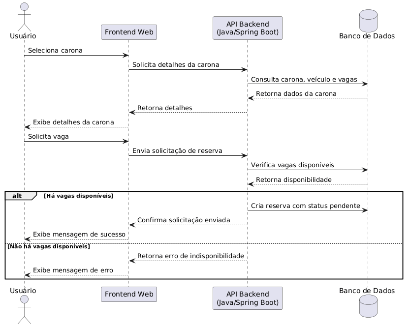

# Modelagem do Sistema PegUFLA

## 1. Diagrama de Casos de Uso

O diagrama de casos de uso apresenta o ator principal do sistema, o usuário, e as funcionalidades centrais oferecidas pela aplicação, como cadastro, login, recuperação de senha, criação e busca de caronas, solicitação de vaga, gerenciamento de reservas, histórico e mensagens internas.

Foi utilizado apenas um ator, pois o sistema não possui perfis fixos de motorista e passageiro. O mesmo usuário pode realizar diferentes ações conforme o contexto, como criar caronas, solicitar participação ou gerenciar solicitações de uma carona criada. Considera-se que a maioria das funcionalidades depende de autenticação prévia, com exceção de cadastro, login e recuperação de senha.

## 2. Diagrama de Componentes

O diagrama de componentes representa a estrutura geral da aplicação web PegUFLA, separando frontend, backend, serviços internos e banco de dados. Esse modelo auxilia na compreensão da organização do sistema e na justificativa das decisões arquiteturais adotadas.

## 3. Modelo de Dados

O modelo de dados apresenta as entidades centrais do sistema, como usuário, veículo, carona, reserva e mensagem, bem como seus relacionamentos. Ele serve de base para a implementação do banco de dados e para a compreensão das regras de negócio da aplicação.

## 4. Diagrama de Sequência

O diagrama de sequência detalha o fluxo de solicitação de vaga em uma carona no sistema PegUFLA, mostrando como o usuário interage com a interface web e como a solicitação percorre o backend e o banco de dados.

Nesse fluxo, o usuário seleciona uma carona, visualiza seus detalhes e solicita uma vaga. O sistema verifica a disponibilidade e, caso existam vagas, registra uma reserva com status pendente. Caso não haja disponibilidade, uma mensagem de erro é retornada ao usuário.

## 7. Vínculo entre requisitos e modelos

A tabela a seguir apresenta a relação entre os requisitos funcionais do sistema PegUFLA e os modelos elaborados na Sprint 03, evidenciando como cada funcionalidade é representada nas diferentes modelagens.

| Requisito | Modelo relacionado | Justificativa |
|----------|-------------------|--------------|
| RF01 – Cadastro de usuário | Casos de Uso / Modelo de Dados | Representa o cadastro e persistência das informações do usuário |
| RF02 – Login | Casos de Uso / Componentes | Evidencia o processo de autenticação e interação entre frontend e backend |
| RF03 – Criar carona | Casos de Uso / Modelo de Dados | Representa a criação de caronas e seu armazenamento no sistema |
| RF04 – Buscar carona | Casos de Uso / Componentes | Relaciona a consulta de caronas disponíveis e interação com a API |
| RF05 – Solicitar vaga | Casos de Uso / Sequência / Modelo de Dados | Representa o principal fluxo de negócio e a criação de reservas |
| RF06 – Aprovar/Rejeitar solicitação | Casos de Uso / Modelo de Dados | Representa a gestão das solicitações de participação |
| RF07 – Visualizar detalhes da carona | Casos de Uso / Componentes | Relaciona a consulta de informações detalhadas da carona |
| RF08 – Cancelar participação | Casos de Uso / Modelo de Dados | Representa a atualização do status da reserva |
| RF09 – Excluir carona | Casos de Uso / Modelo de Dados | Representa a remoção de caronas do sistema |
| RF10 – Histórico de caronas | Casos de Uso / Modelo de Dados | Relaciona a consulta de registros de utilização do sistema |
| RF11 – Mensagens internas | Casos de Uso / Modelo de Dados | Representa a troca de mensagens entre usuários vinculados à carona |
| RF12 – Recuperar senha | Casos de Uso / Componentes | Representa o fluxo de recuperação de acesso do usuário |
| RF13 – Gerenciar veículos | Casos de Uso / Modelo de Dados | Representa o cadastro e manutenção dos veículos do usuário |
