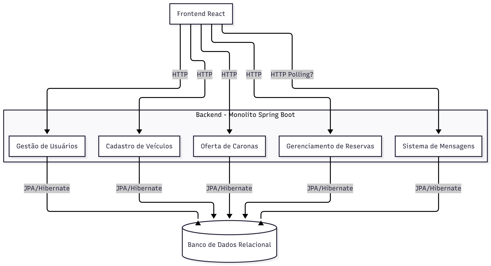

# Arquitetura de Software

## 1. Visão arquitetural da solução

O PegUFLA adota uma arquitetura monolítica em camadas, organizada em frontend, backend e banco de dados relacional. A comunicação entre os componentes ocorre por meio de uma API REST, permitindo separação clara entre interface, regras de negócio e persistência de dados.

A solução foi estruturada utilizando o padrão MVC (Model-View-Controller) no backend, organizado em camadas lógicas responsáveis pelo controle das requisições, processamento das regras de negócio e persistência das informações.

O frontend foi desenvolvido em React, atuando como camada de apresentação responsável pela interação com o usuário e consumo da API disponibilizada pelo backend.

---

## 2. Estilo arquitetural adotado

- Arquitetura em camadas;
- Backend monolítico;
- API RESTful Stateless.

### Justificativa da escolha

A arquitetura em camadas foi adotada por permitir separação clara de responsabilidades, baixo acoplamento entre componentes e maior facilidade de manutenção.

A escolha de um backend monolítico utilizando Spring Boot foi considerada adequada ao escopo atual do projeto, evitando complexidade desnecessária associada a arquiteturas distribuídas.

Além disso, a separação entre frontend e backend favorece organização modular da aplicação e possibilita evolução incremental das funcionalidades.

---

## 3. Diagrama de arquitetura

### Descrição geral do fluxo

1. O usuário interage com a interface React;
2. O frontend envia requisições HTTP para o backend;
3. O backend processa as requisições por meio dos módulos internos;
4. Os módulos acessam o banco de dados utilizando JPA/Hibernate;
5. O backend retorna as respostas para o frontend.

---

## 4. Componentes da arquitetura

| Componente | Responsabilidade |
|---|---|
| Frontend React | Responsável pela interface do usuário, navegação entre telas e consumo da API REST. |
| Backend Spring Boot | Centraliza regras de negócio, validações, autenticação e comunicação com o banco de dados. |
| Gestão de Usuários | Responsável por cadastro, autenticação e gerenciamento de informações dos usuários. |
| Cadastro de Veículos | Responsável pelo gerenciamento de veículos cadastrados pelos usuários. |
| Oferta de Caronas | Responsável pela criação, consulta e gerenciamento das caronas disponíveis. |
| Gerenciamento de Reservas | Responsável pelas solicitações, aprovações, rejeições e cancelamentos de participação. |
| Sistema de Mensagens | Responsável pela comunicação entre usuários vinculados às caronas. |
| Banco de Dados Relacional | Responsável pelo armazenamento persistente das informações da aplicação. |

---

## 5. Organização das camadas

### 5.1 Camada de apresentação

Responsável pelas telas e interações com o usuário no frontend React.

Exemplos:
- tela inicial;
- tela de criação de carona;
- tela de busca de caronas;
- telas de perfil;
- gerenciamento de veículos.

---

### 5.2 Camada de controle

Responsável por receber requisições HTTP e direcioná-las para os serviços apropriados.

Exemplos:
- Controllers REST;
- validações iniciais;
- endpoints da API.

---

### 5.3 Camada de regras de negócio

Responsável pelo processamento das regras centrais do sistema.

Exemplos:
- validação de reservas;
- controle de vagas disponíveis;
- autenticação e autorização;
- gerenciamento de permissões.

---

### 5.4 Camada de persistência

Responsável pela comunicação com o banco de dados.

Exemplos:
- Repositories;
- entidades JPA;
- consultas persistentes;
- gerenciamento transacional.

---

## 6. Tecnologias utilizadas

| Tecnologia | Finalidade |
|---|---|
| React | Desenvolvimento do frontend |
| Spring Boot | Desenvolvimento do backend |
| Spring Security | Autenticação e autorização |
| JPA/Hibernate | Persistência de dados |
| PostgreSQL | Banco de dados relacional |
| GitHub | Versionamento e documentação |

---

## 7. Relação entre arquitetura e requisitos

| Requisito | Relação arquitetural |
|---|---|
| RF01 – Cadastro de usuários | Utiliza módulo de Gestão de Usuários e persistência relacional. |
| RF03 – Criar carona | Utiliza módulo Oferta de Caronas e regras de negócio no backend. |
| RF05 – Solicitar vaga | Utiliza módulo Gerenciamento de Reservas e controle transacional. |
| RF06 – Aprovar/Rejeitar solicitação | Utiliza regras de autorização e gerenciamento de reservas. |
| RF08 – Cancelar participação | Utiliza atualização transacional de reservas e vagas disponíveis. |
| RF13 – Gerenciar veículos | Utiliza módulo Cadastro de Veículos integrado ao perfil do usuário. |

---

## 8. Atributos de qualidade considerados

| Atributo | Aplicação na arquitetura |
|---|---|
| Modularidade | Separação da aplicação em módulos especializados. |
| Baixo acoplamento | Separação entre frontend, backend e persistência. |
| Coesão | Cada módulo possui responsabilidades específicas. |
| Manutenibilidade | Estrutura em camadas facilita manutenção e evolução. |
| Segurança | Uso de autenticação JWT e validações no backend. |
| Escalabilidade | Organização modular facilita expansão futura da aplicação. |

---

## 9. Decisões arquiteturais

| Decisão | Justificativa |
|---|---|
| Utilização de arquitetura monolítica | Adequada ao escopo acadêmico e à complexidade atual do projeto. |
| Separação entre frontend e backend | Facilita manutenção, modularidade e integração. |
| Uso de API REST | Simplifica comunicação entre componentes da aplicação. |
| Persistência relacional | Adequada aos relacionamentos entre usuários, caronas, reservas e veículos. |
| Centralização das regras no backend | Garante maior segurança e consistência dos dados. |

---

## 10. Relação com sprints anteriores

### Sprint 4 – Princípios de projeto

As decisões relacionadas à modularização, separação de responsabilidades e organização em camadas foram inicialmente definidas na Sprint 4.

### Sprint 5 – Padrões de projeto

Os padrões de projeto avaliados e adotados na Sprint 5 influenciaram diretamente a arquitetura consolidada da aplicação, especialmente:
- DTO;
- Repository;
- Dependency Injection;
- MVC.

---

## 11. Consolidação da estrutura da aplicação

A arquitetura consolidada do PegUFLA mantém separação clara entre interface, regras de negócio e persistência de dados, permitindo evolução incremental da aplicação e organização adequada dos módulos do sistema.

A estrutura adotada favorece integração contínua entre frontend e backend, além de facilitar futuras expansões do sistema.
