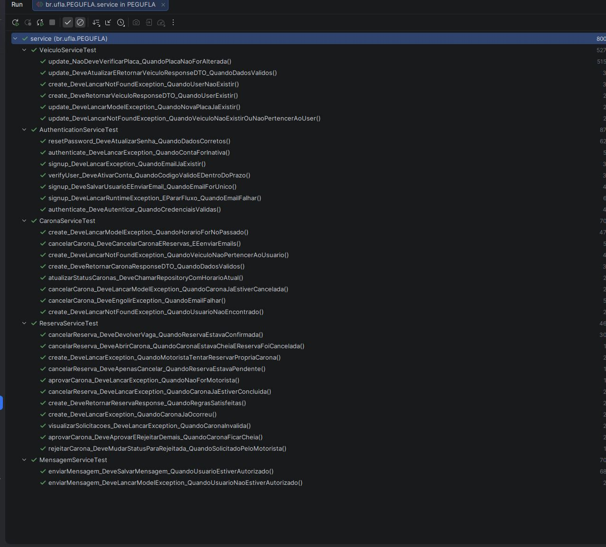
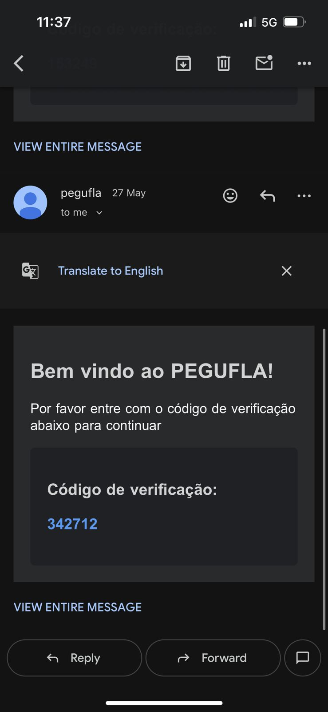
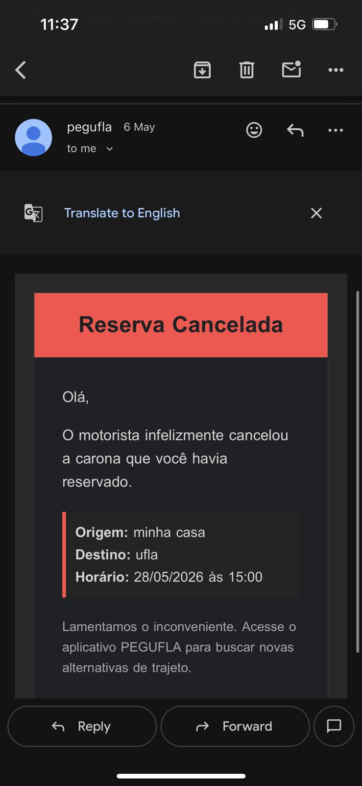
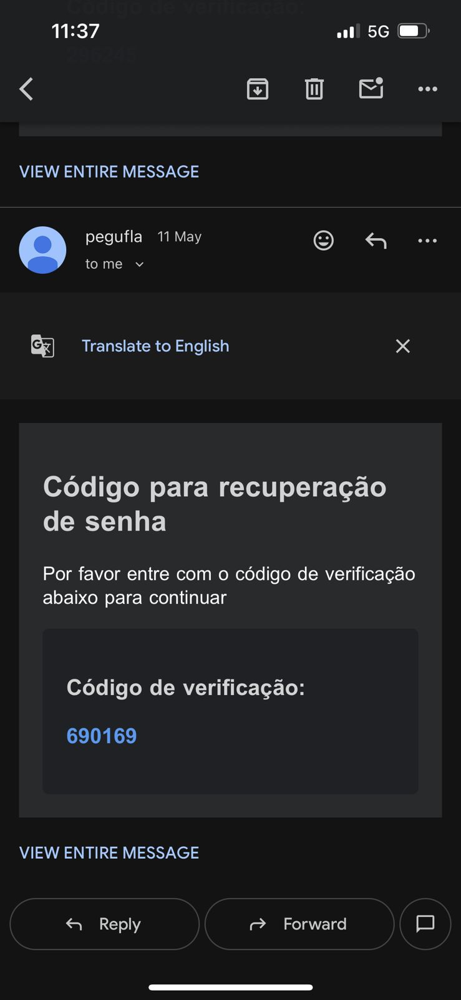
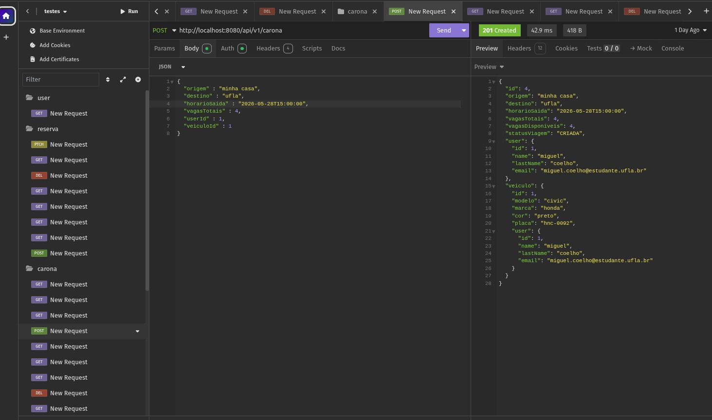
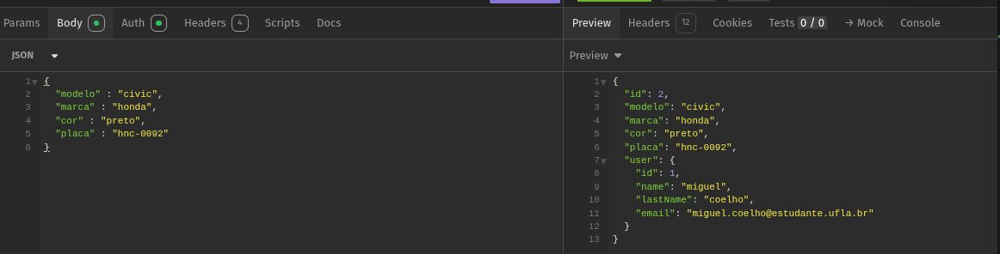
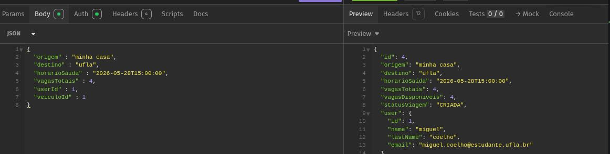

# 09. Testes

## 1. Estratégia de testes
A estratégia de validação do backend do PegUFLA baseia-se em três pilares: testes unitários para a lógica de negócio (Service Layer), testes de API REST para validar a interface da API (Controller Layer) e testes de integração para fluxos externos (Mensageria/E-mail). O objetivo é garantir que cada unidade de código seja robusta, que os contratos HTTP sejam respeitados e que a comunicação com o mundo externo funcione como esperado.

### Objetivos
- Garantir a corretude da lógica de domínio através de isolamento.
- Validar a conformidade das respostas da API (status code e estrutura JSON).
- Confirmar a integridade da entrega de notificações ao usuário final.

---

## 2. Tipos de teste previstos
| Tipo de teste | Objetivo | Evidência esperada |
|---|---|---|
| Teste unitário | Validar regras de negócio e cálculos isolados | Relatório de execução da suíte de testes (Green build) |
| Teste de contrato/API | Validar a estrutura de dados e status HTTP | Logs de requisição e resposta (Status/Body) |
| Teste de integração | Validar comunicação com serviços externos | Logs de envio e confirmação de recebimento (E-mail/Serviços) |

---

## 3. Casos de teste

| ID | Requisito relacionado | Cenário | Entrada | Resultado esperado | Resultado obtido |
|---|---|---|---|---|---|
| CT01 | RF01 | Cadastro com e-mail válido | DTO de cadastro válido | Usuário criado e e-mail enviado | Sucesso |
| CT02 | RF02 | Autenticação de usuário | Credenciais válidas | Login realizado com sucesso | Sucesso |
| CT03 | RF03 | Criação de carona válida | DTO de carona completo | Carona criada com status `201 Created` | Sucesso |
| CT04 | RF04 | Consulta/listagem de caronas | Filtros de busca válidos | Lista de caronas retornada | Sucesso |
| CT05 | RF05 | Reserva em carona disponível | ID do usuário e ID da carona | Reserva criada com status pendente | Sucesso |
| CT06 | RF06 | Aprovação/rejeição de reserva | ID da reserva e ação escolhida | Status da reserva atualizado | Sucesso |
| CT07 | RF07 | Consulta de detalhes da carona | ID da carona | Dados detalhados da carona retornados | Sucesso |
| CT08 | RF08 | Cancelamento de reserva | ID da reserva | Reserva cancelada e vaga liberada | Sucesso |
| CT09 | RF09 | Exclusão de carona | ID da carona | Carona removida ou marcada como excluída | Sucesso |
| CT10 | RF10 | Consulta de histórico de caronas | Usuário autenticado | Histórico de caronas retornado | Sucesso |
| CT11 | RF11 | Envio e consulta de mensagens | Texto, usuário e carona válidos | Mensagem persistida e listada | Sucesso |
| CT12 | RF12 | Recuperação de senha | E-mail cadastrado e código válido | Código enviado e senha redefinida | Sucesso |
| CT13 | RF13 | Cadastro e gerenciamento de veículos | Dados válidos do veículo | Veículo cadastrado, listado e gerenciado | Sucesso |

---

## 4. Critérios de aceitação dos testes
- Cobertura mínima da lógica de negócio através de testes unitários (Service).
- Sucesso nos códigos de status HTTP para operações de CRUD (200, 201, 204).
- Respeito à estrutura do DTO definida no contrato da API.
- Registro de logs para toda falha de integração identificada.

---

## 5. Registro de defeitos
| ID | Defeito | Severidade | Status | Ação tomada |
|---|---|---|---|---|
| BUG01 | Endpoint de criação de veículo retornava 200 OK em vez de 201 Created. | Baixa | Corrigido | Ajustada a semântica da resposta no Controller de Veículos. |
| BUG02 |  	Falha de encapsulamento no DTO da carona, expondo dados internos indesejados na resposta da API. | Alta | Corrigido | Criação de DTO de saída estrito para o contrato de resposta. |

---

## 6. Evidências

**Figura 1 –** Evidência de testes e validação das rotas da API REST utilizando cliente HTTP.

**Figura 2 –** Evidência do envio de e-mail de verificação durante o processo de cadastro/autenticação do usuário.

**Figura 3 –** Evidência do envio automático de e-mail relacionado ao cancelamento de reserva de carona.

**Figura 4 –** Evidência do envio de e-mail para recuperação de senha com código de verificação.

**Figura 5 –** Execução dos testes automatizados da camada de serviços do backend utilizando JUnit.

---

## 7. Exemplo resumido
> O contrato da API de Caronas (RF-Carona) será validado através do caso de teste CT02, onde uma requisição POST é enviada ao endpoint com os dados obrigatórios. Espera-se o retorno 201 Created com o DTO completo, incluindo dados do usuário e veículo, validando a integridade da comunicação e das regras de negócio associadas.
